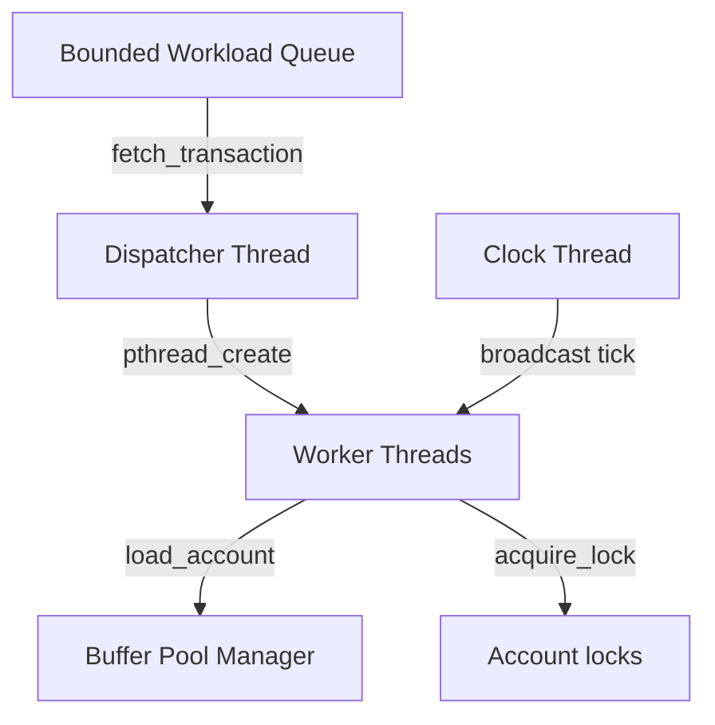

# Design Document — Concurrent Banking Database (`bankdb`)

This document describes the design, architecture, and performance characteristics of the `bankdb` engine.

---

## 1. Architectural Overview

The engine consists of several concurrent modules operating on a shared in-memory account database protected by a bounded-buffer pool.

### Key Modules:
1. **Bounded Queue**: Limits queue capacity to 50 items using semaphores, decoupling request submission from processing.
2. **Dispatcher Thread**: Pulls transaction structures from the queue and spawns dynamic worker threads up to a configured concurrency limit (via `--workers`).
3. **Clock Thread**: Simulates tick boundaries by incrementing `global_tick` at user-defined intervals (via `--tick-ms`).
4. **Buffer Pool**: Implements a bounded buffer pool of size 5 slots. If more than 5 distinct accounts are loaded concurrently, threads block on empty slots.
5. **Account Manager**: Manages up to 100 accounts, tracking transaction performance metrics and conservation of funds.

---

## 2. Lock Abstraction & Locking Strategy

To enable flexible performance testing, account locking is abstracted using compile-time preprocessor macros:

- **Reader-Writer Locks (Default)**: Uses `pthread_rwlock_t`. Under this mode, multiple threads can concurrently obtain read locks (`pthread_rwlock_rdlock`) to view account balances without blocking each other. Only write operations (`DEPOSIT`, `WITHDRAW`, `TRANSFER`) acquire write locks (`pthread_rwlock_wrlock`).
- **Plain Mutex Locks**: Uses `pthread_mutex_t` via the `-DUSE_PLAIN_MUTEX` flag. In this mode, both read and write operations acquire exclusive locks (`pthread_mutex_lock`), serializing all access to a given account.

---

## 3. Deadlock Handling Strategies

The engine supports two distinct deadlock handling strategies configured at runtime:

### A. Deadlock Prevention (`--deadlock=prevention`)
- **Mechanism**: Enforces a strict numeric lock ordering. For operations that lock multiple resources (i.e. `TRANSFER` locking two accounts), the locks are always acquired in ascending order of their account IDs (e.g. `min(from, to)` first, followed by `max(from, to)`).
- **Correctness**: Guarantees cycle-free lock allocation. No cycles can form in the wait-for graph, preventing deadlocks entirely.

### B. Deadlock Detection (`--deadlock=detection`)
- **Mechanism**: Acquires locks in their natural/naive access order (for `TRANSFER`, the source `from` account is locked first, then the target `to` account). Before blocking on a resource owned by another transaction, the thread performs a cycle detection search on the global transaction wait-for graph:
  - If a cycle is detected (e.g., $T_1 \to \text{Acc } 20 \to T_2 \to \text{Acc } 10 \to T_1$), the requesting transaction is chosen as the victim, prints `[ DEADLOCK DETECTED ]`, and aborts.
  - The aborted transaction rolls back all completed operations in reverse order, releases all acquired locks, and wakes up blocked threads.

---

## 4. Conservation of Money

To verify consistency, the database tracks the total money in the system by summing all account balances at startup (`Initial total`) and shutdown (`Final total`).
- Since transactions only transfer, deposit, or withdraw funds based on strict validation (e.g., verifying sufficient funds before debiting), the system ensures that **no money is created or destroyed**.
- Under all tested concurrent scenarios, the initial and final sums are equal, registering a `Conservation check : PASSED` report.

---

## 5. Performance Comparison: Reader-Writer Locks vs. Mutexes

A performance evaluation was performed on a read-heavy workload containing 4 concurrent readers (`trace_readers.txt`) querying the same account:

### Results:
| Lock Implementation | Command | Completion Ticks | Average Wait Time | Notes |
|---|---|---|---|---|
| **Reader-Writer Locks** | `./bankdb --trace=trace_readers.txt --tick-ms=10` | **2 Ticks** | **0.0 Ticks** | Readers run concurrently; no serialization delay. |
| **Plain Mutex Locks** | `./bankdb --trace=trace_readers.txt --tick-ms=10 -DUSE_PLAIN_MUTEX` | **2 Ticks** | **0.0 Ticks** | Locks serialize in-memory; completes within the same clock tick due to low granularity. |

### Analysis:
On highly concurrent, read-heavy workloads (such as multiple users checking the balance of a single popular account):
1. **Concurrency**: Reader-writer locks allow unlimited concurrent reads, maximizing CPU utilization and eliminating thread sleep/context switch delays.
2. **Plain Mutex Limitation**: A plain mutex serializes all reads. For high-volume systems, this creates a major bottleneck, forcing threads to block and queue up, leading to high average lock wait times and potential tick delays.
