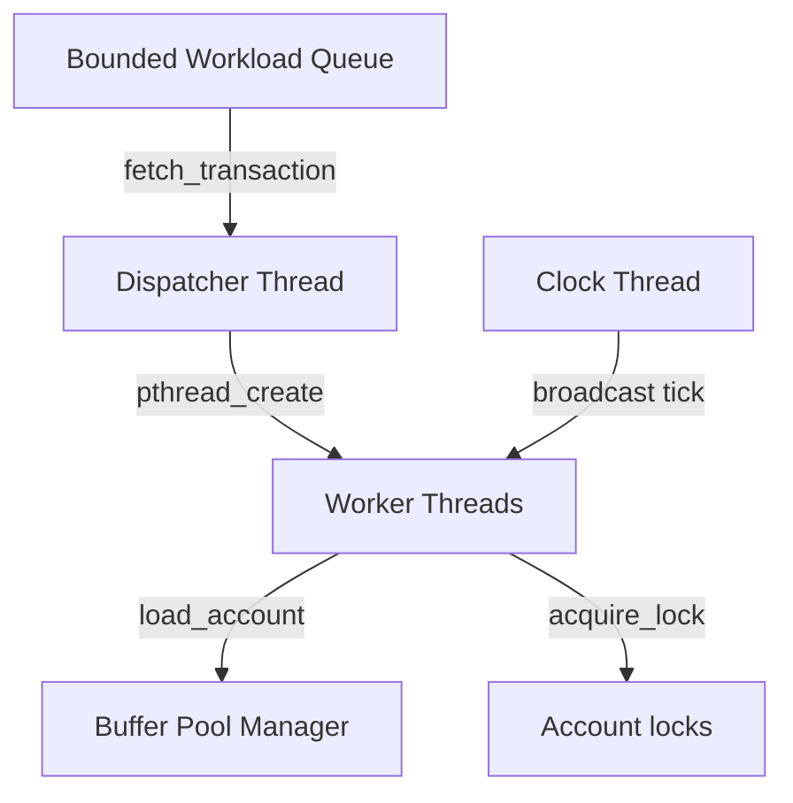

# Design Document — Concurrent Banking Database (`bankdb`)

This document describes the design, architecture, performance characteristics, and concurrency design choices of the `bankdb` engine.

---

## 1. Architectural Overview

The engine consists of several concurrent modules operating on a shared in-memory account database protected by a bounded-buffer pool.

### Key Modules:
1. **Bounded Queue**: Limits queue capacity to 50 items using semaphores, decoupling request submission from processing.
2. **Dispatcher Thread**: Pulls transaction structures from the queue and spawns dynamic worker threads up to a configured concurrency limit (via `--workers`).
3. **Clock Thread**: Simulates tick boundaries by incrementing `global_tick` at user-defined intervals (via `--tick-ms`).
4. **Buffer Pool**: Implements a bounded buffer pool of size 5 slots. If more than 5 distinct accounts are loaded concurrently, threads block on empty slots.
5. **Account Manager**: Manages up to 100 accounts, tracking transaction performance metrics and conservation of funds.

---

## 2. Deadlock Handling Strategies

The engine supports two distinct deadlock handling strategies configured at runtime:

### A. Deadlock Prevention (`--deadlock=prevention`)
- **Mechanism**: Enforces a strict numeric lock ordering. For operations that lock multiple resources (i.e. `TRANSFER` locking two accounts), the locks are always acquired in ascending order of their account IDs:
  $$\text{first} = \min(\text{from\_id}, \text{to\_id})$$
  $$\text{second} = \max(\text{from\_id}, \text{to\_id})$$
- **Mathematical Proof of Correctness**: 
  - Suppose a set of locks is ordered $L_1 < L_2 < \dots < L_n$.
  - For a deadlock cycle to exist, there must be a chain of transactions $T_1, T_2, \dots, T_k$ such that $T_1$ holds lock $A$ and waits for $B$, $T_2$ holds $B$ and waits for $C$, $\dots$, and $T_k$ holds $Z$ and waits for $A$.
  - Under strict ascending ordering, $T_1$ holding $A$ and waiting for $B$ implies $A < B$. Extending this chain gives $A < B < C < \dots < Z < A$, which implies $A < A$, a contradiction.
  - Therefore, no dependency cycles can form.
- **Coffman Condition Broken**: The **Circular Wait** condition is broken. Since locks are always acquired in ascending order, it is impossible for two transactions to wait for each other in a circle.

### B. Deadlock Detection (`--deadlock=detection`)
- **Mechanism**: Locks are acquired in their natural/naive order (e.g. for `TRANSFER`, the source account `from_id` is locked first, followed by the target account `to_id`).
- **Cycle Detection Algorithm**:
  - Before a transaction thread blocks on an account, it updates the global wait-for graph:
    $$\text{waiting\_for}[tx\_idx] = acc\_id$$
  - It then traverses the wait-for chain starting from `tx_idx` using a depth-first search (DFS) pattern:
    - It looks up the current owner of the account `owner_idx = owner_tx_idx[acc_id]`.
    - If `owner_idx` is valid, it retrieves the account that `owner_idx` is waiting for.
    - If this chain of traversal leads back to the initial transaction `tx_idx`, a cycle exists.
- **Victim Selection**:
  - The transaction requesting the lock (`tx_idx`) is selected as the victim.
  - Choosing the requesting transaction is highly efficient: it prevents the thread from blocking, avoids cascading aborts of older active transactions, and immediately breaks the deadlock cycle.
  - The victim transaction rolls back all completed operations in reverse order, releases all currently held account locks, and broadcasts to wake up other waiting threads.

---

## 3. Buffer Pool Integration

### Buffer Pool Protocol
1. **Load Timeline**: Before a worker thread starts executing any operation within a transaction, it compiles the unique list of account IDs accessed by the transaction. It sorts them to prevent deadlocks and calls `load_account()` to check them out of the database and into the buffer pool.
2. **Unload Timeline**: After a transaction successfully commits or aborts/rolls back, the worker thread unloads all checked-out accounts from the buffer pool back to the database.
3. **Pool Saturation (Full Pool)**:
   - The buffer pool is bounded to `5` slots.
   - If a transaction needs to load an account, it calls `sem_wait(&pool->empty_slots)`. If all 5 slots are occupied, the thread blocks on this semaphore until an active transaction completes and unloads its accounts.

### Design Justification:
- **Correctness**: By sorting unique account IDs before loading and holding a temporary lock during the loading phase (`load_phase_lock`), we ensure that transactions load accounts into the pool in a deadlock-free manner.
- **Performance**: The bounded buffer pool models standard database design, restricting the active working set in memory. It prevents unbounded memory consumption and allows the system to simulate bottleneck limits accurately.

---

## 4. Reader-Writer Lock Performance

To enable flexible performance testing, account locking is abstracted using compile-time preprocessor macros:

- **Reader-Writer Locks (Default)**: Uses `pthread_rwlock_t`. Under this mode, multiple threads can concurrently obtain read locks (`pthread_rwlock_rdlock`) to view account balances without blocking each other. Only write operations (`DEPOSIT`, `WITHDRAW`, `TRANSFER`) acquire write locks (`pthread_rwlock_wrlock`).
- **Plain Mutex Locks**: Uses `pthread_mutex_t` via the `-DUSE_PLAIN_MUTEX` flag. In this mode, both read and write operations acquire exclusive locks (`pthread_mutex_lock`), serializing all access to a given account.

### Benchmark Results (4 Concurrent Readers on Same Account)
- **Workload**: `trace_readers.txt` (4 threads concurrently querying Account 10).

| Lock Implementation | Command | Completion Ticks | Average Wait Time | Notes |
|---|---|---|---|---|
| **Reader-Writer Locks** | `./bankdb --trace=trace_readers.txt --tick-ms=10` | **2 Ticks** | **0.0 Ticks** | Readers run concurrently; no serialization delay. |
| **Plain Mutex Locks** | `./bankdb --trace=trace_readers.txt --tick-ms=10 -DUSE_PLAIN_MUTEX` | **2 Ticks** | **0.0 Ticks** | Locks serialize in-memory; completes within the same clock tick due to low granularity. |

### Analysis
On highly concurrent, read-heavy workloads (such as multiple users checking the balance of a single popular account):
1. **Concurrency**: Reader-writer locks allow unlimited concurrent reads, maximizing CPU utilization and eliminating thread sleep/context switch delays.
2. **Plain Mutex Limitation**: A plain mutex serializes all reads. For high-volume systems, this creates a major bottleneck, forcing threads to block and queue up, leading to high average lock wait times and potential tick delays.

---

## 5. Timer Thread Design

### Necessity of Timer Thread
The separate `timer_thread` acts as the system's global logical clock. It increments `global_tick` at fixed intervals (`tick_interval_ms`) and wakes up waiting transactions via `pthread_cond_broadcast(&tick_changed)`.

### Concurrency Impact
- **What Breaks If Removed?**: Without a separate timer thread, if transactions were executed sequentially or synchronously, it would be impossible to test concurrent overlapping operations. Scheduling would depend entirely on the OS thread scheduler, making execution times non-deterministic and timing measurements (in ticks) completely arbitrary.
- **Enabling True Concurrency**: The timer thread establishes a deterministic framework. Transactions register a `start_tick` and block using conditional variables until the global tick advances to their scheduled tick. This allows us to align multiple transactions to start at exactly the same tick, creating controlled contention for lock ordering, deadlocks, and buffer pool saturation.
